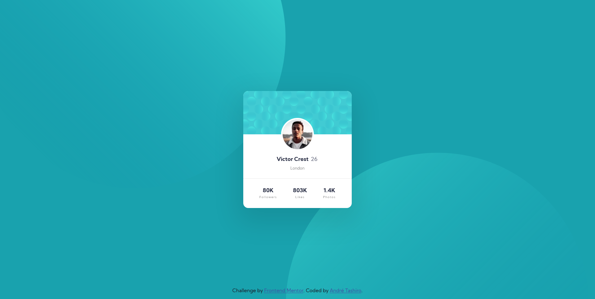
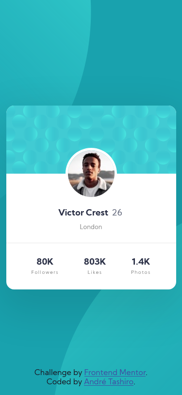

# Frontend Mentor - Profile card component solution

This is a solution to the [Profile card component challenge on Frontend Mentor](https://www.frontendmentor.io/challenges/profile-card-component-cfArpWshJ). Frontend Mentor challenges help you improve your coding skills by building realistic projects. 

## Table of contents

- [Overview](#overview)
  - [The challenge](#the-challenge)
  - [Screenshot](#screenshot)
  - [Links](#links)
- [My process](#my-process)
  - [Built with](#built-with)
  - [Useful resources](#useful-resources)
- [Author](#author)

## Overview

### The challenge

- Build out the project to the designs provided

### Screenshot

<h4 align="center">Desktop Version</h4>

<h4 align="center">Mobile Version</h4>

  

### Links

<!-- - Solution URL: [Add solution URL here](https://your-solution-url.com) -->
- Live Site URL: [Github Page](https://andreseichi.github.io/profile-card-component/)

## My process

### Built with

- Semantic HTML5 markup
- CSS custom properties
- Preprocessor [SASS](https://sass-lang.com/)
- Flexbox
- [Styled Components](https://styled-components.com/) - For styles

### Useful resources

- [Using multiple backgrounds](https://developer.mozilla.org/en-US/docs/Web/CSS/CSS_Backgrounds_and_Borders/Using_multiple_backgrounds) - Learned how to use more than one background in an element and how to manipulate each of them.

## Author

- Github - [André Tashiro](https://github.com/andreseichi)
- Frontend Mentor - [@andreseichi](https://www.frontendmentor.io/profile/andreseichi)